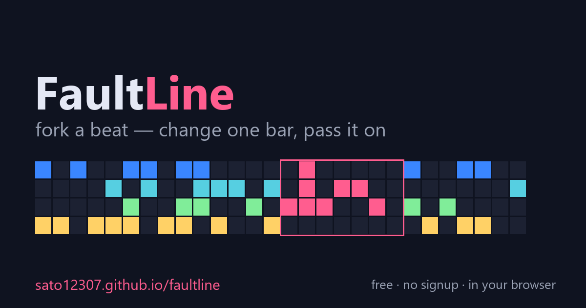

# FaultLine — fork a beat

**A free online beat maker where you can't post a beat from scratch — you _fork_ someone's beat, change exactly one bar, and pass it on.** A derivation tree grows from every original, crediting the whole chain.

▶ **[Play it live](https://sato12307.github.io/faultline/)** &nbsp;·&nbsp; 🎮 **[on itch.io](https://kojidhfj.itch.io/faultline-fork-a-beat)**



## What is it?

FaultLine is a tiny, free **online beat maker / step sequencer** that runs entirely in your browser. No signup, no install, no ads. Pick a beat, change **one bar**, and share your **fork** — and the next person forks yours. It's inspired by **BMS 差分** and **osu! guest-difficulty** culture: building variations on each other's charts, with credit.

- 🎛️ **6-lane drum grid**, 8 swappable sounds (kick, sub, snare, clap, hi-hats, tom, rim), 2 / 4 / 8 bars
- 🍴 **Fork a beat** — to post, you must change at least one bar; a lineage tree grows from each original
- 🔗 **Copy fork link** — hand your beat to the next person; 🖼️ **Save card** for a shareable image
- 🌐 **English / 日本語** auto-switch
- 🆓 Free, no signup, mobile-friendly

## The interesting part: there's no backend

The whole beat — taps, per-lane sounds, bar count, and the lineage chain — is **bit-packed and base64url-encoded into the URL**. So "forking" is literally just opening a link, and the entire app is **one static HTML file**: no database, no server, no accounts. The drums are synthesized live with the **Web Audio API**, so there are no audio files either.

That means you can host it anywhere static (GitHub Pages, Cloudflare Pages, itch.io) for free, and every shared beat is self-contained in its link.

## How to play

1. Click cells in the grid to place drum hits; choose each lane's sound from the rack.
2. Press play, switch between 2 / 4 / 8 bars, set the BPM.
3. Hit **Copy fork link** to pass your beat on, or **Save card** for an image.
4. Open a fork link → change a *different* bar → it's now yours.

## Run / self-host

It's a single file. Clone and open `index.html`, or drop it on any static host:

```bash
git clone https://github.com/sato12307/faultline
# then just open index.html, or serve the folder:
python -m http.server
```

## 日本語

**他人のビートを「1小節だけ」改変して投稿＝フォーク**できる、無料・登録不要のブラウザ用オンライン・ビートメーカーです。譜面データはURLに丸ごと入る（サーバー/DBなし・Web Audio合成）ので、リンクを送るだけでフォークの連鎖がつながります。BMSの差分文化／osu! のゲスト譜面文化にインスパイアされています。 → **[今すぐ遊ぶ](https://sato12307.github.io/faultline/)**

---

Made for fun. Fork the beats — and the code if you like.
